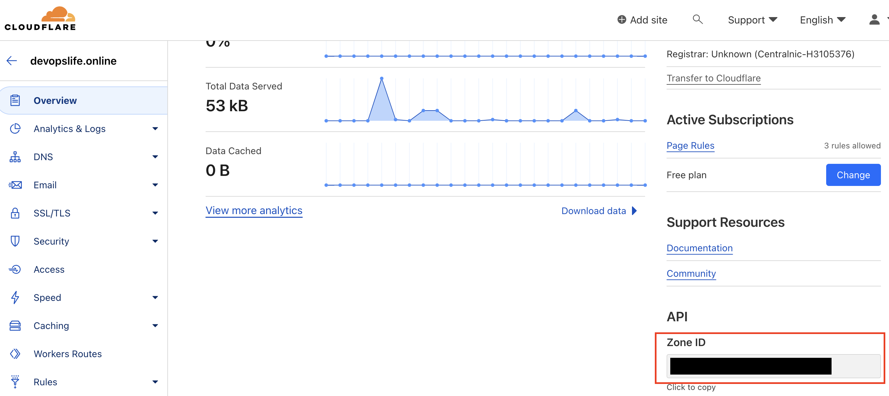
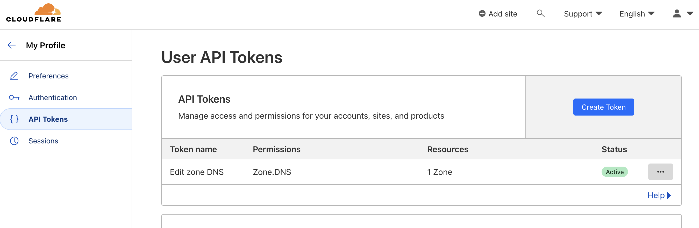
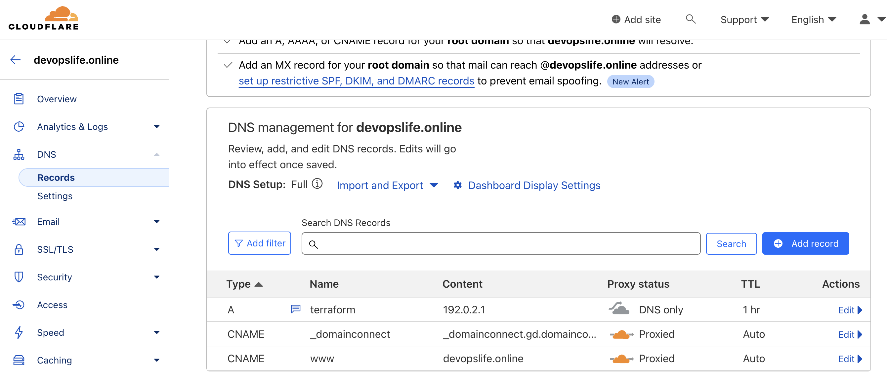
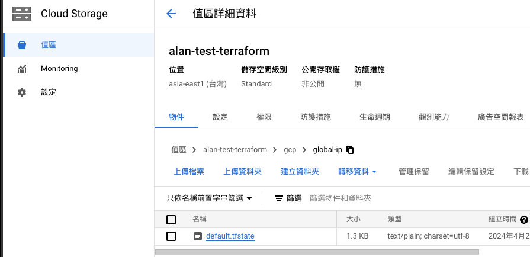
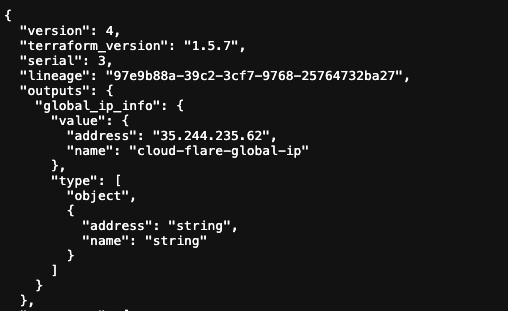
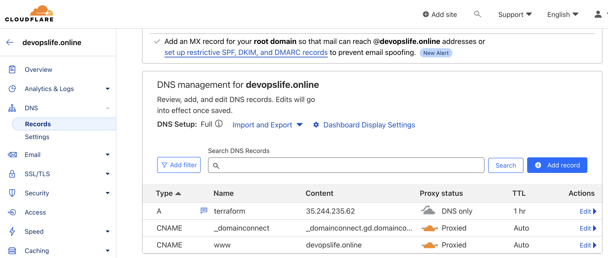

# terraform-cloudflare

## 👨‍💻簡介

之前透過 [Terraform 建立 GCP Global IP](https://sz9751210.github.io/posts/tf-global-ip)，延續上一篇的文，我們要把 Global IP 在 CloudFlare 上做 DNS 解析綁定，使我們一般在瀏覽網頁時能夠輸入網址進行訪問。

## 🛠️使用工具
- Terraform
- CloudFlare
- GCS

## 📝功能需求
1. 研究 Terraform 建立 CloudFlare DNS 解析
2. 取得 GCS 上的 Terraform state file 並透過 terraform 建立 CloudFlare DNS 解析
3. 模組化

## 🎯Setup

### 1. 研究 Terraform 建立 CloudFlare DNS 解析
查看 [terraform cloudflare_record 官方文件 ](https://registry.terraform.io/providers/cloudflare/cloudflare/latest/docs/resources/record)可以看到與 dns 的相關設定會使用這個 resource。
而要操作 CloudFlare 必須取得要調整的 Website zone id 與操作者的 api token





接下來開始撰寫 terraform 代碼
```hcl
resource "cloudflare_record" "example" {
  zone_id = "your_zone_id"
  name    = "terraform"
  type    = "A"
  comment = "Managed by Terraform"
  value   = "192.0.2.1"
  proxied = false
  ttl     = 3600
}

terraform {
  required_providers {
    cloudflare = {
      source = "cloudflare/cloudflare"
      version = "4.28.0"
    }
  }
}

provider "cloudflare" {
    api_token = "your_api_token"
  
}
```

接著執行 terraform 指令部署上去就可以到 CloudFlare 頁面上查看是否建立成功。



### 2. 取得 GCS 上的 Terraform state file 並透過 terraform 建立 CloudFlare DNS 解析
這部分需要提前設定好狀態檔



狀態檔如下



接著修改 terraform 代碼，在代碼的部分使用 data 去取得 GCS 上的 Global IP 狀態檔
```hcl
resource "cloudflare_record" "example" {
  zone_id = "your_zone_id"
  name    = "terraform"
  type    = "A"
  comment = "Managed by Terraform"
  # 添加這行取得IP
  value   = data.terraform_remote_state.global_ip.outputs.global_ip_info.address
  proxied = false
  ttl     = 3600
}

# 來源設定
data "terraform_remote_state" "global_ip" {
  backend = "gcs"
  config = {
    bucket = "alan-test-terraform"
    prefix = "gcp/global-ip"
  }
}

```



### 3. 模組化
先建立一個資料夾叫做 modules，並依序建立以下檔案放在這個資料夾
#### 1. 撰寫 `variables.tf`
```hcl:variables.tf
variable "cloudflare_api_token" {
  type = string
}

variable "zone_id" {
  type = string
}

variable "name" {
  type = string
}

variable "type" {
  type = string
}

variable "comment" {
  type = string
}

variable "allow_overwrite" {
  type = bool
}

variable "records" {
  type = list(object({
    value   = optional(string)
    proxied = optional(bool, false)
    ttl     = optional(number, 1)
  }))
}


```
這裡補充說明一下 `optional` 函數，這個函數的主要功能是指定這些屬性是可選的，並且當未使用時，第二個欄位則是這個屬性的預設值。


#### 2. 建立 `main.tf`
```hcl
resource "cloudflare_record" "dns_records" {
  for_each        = { for idx, rec in var.records : idx => rec }
  zone_id         = var.zone_id
  name            = var.name
  type            = var.type
  comment         = var.comment
  allow_overwrite = var.allow_overwrite
  value           = each.value.value
  ttl             = each.value.ttl
  proxied         = each.value.proxied
}
```

#### 3. 建立 `outputs.tf`
這裡的用意主要是看想輸出 resource 的哪些值，並將這個 output 的資料結構取名為 `dns_records_details`
```hcl
output "dns_records_details" {
  value = [for r in cloudflare_record.dns_records : {
    address = r.value
    name    = r.name
    type    = r.type
    ttl     = r.ttl
    proxied = r.proxied
  }]
}
```

#### 4. 建立 `provider.tf`
```hcl
terraform {
  required_providers {
    cloudflare = {
      source  = "cloudflare/cloudflare"
      version = "4.28.0"
    }
  }
}

provider "cloudflare" {
  api_token = var.cloudflare_api_token
}
```

接著在主目錄建立自己的設定檔
#### 5. 建立 `main.tf`
```hcl
module "cloudflare_dns_records" {
  source               = "./modules"
  zone_id              = "your-zone-id"
  cloudflare_api_token = "your-api-token"
  name                 = "terraform"
  type                 = "A"
  comment              = "Managed by Terraform"
  allow_overwrite      = false
  records = [{
    value   = data.terraform_remote_state.global_ip.outputs.global_ip_info.address
    proxied = false
    ttl     = null
    }
  ]
}
```
如果有需要新增多筆 records，可以在根目錄

#### 6. 建立 `data.tf`
```hcl
data "terraform_remote_state" "global_ip" {
  backend = "gcs"
  config = {
    bucket = "alan-test-terraform"
    prefix = "gcp/global-ip"
  }
}
```
這裡因為有使用到 gcp 的 global ip，因此需要定義 `data.tf`

#### 7. 建立 `outputs.tf`
```hcl
output "dns_records_list" {
  value = module.cloudflare_dns_records.dns_records_details
}
```

這裡的 output 用意是將 modules 裡的 output 拿來用，因為我們執行的環境是在根目錄下執行，而 modules 裡的 output 只能在內部被定義與訪問，如果要將 modules 的 output 拿來外部使用，必須在要引用的地方定義好 output 值，這樣就能讓你在根目錄下執行 Terraform 時能夠使用 modules 的 output 值。

#### 8. 建立 `provider.tf`
```hcl
terraform {
  required_providers {
    cloudflare = {
      source  = "cloudflare/cloudflare"
      version = "4.28.0"
    }
  }
}
```

這樣就已經完成簡單的模組化了。
完整代碼在[這裡](https://github.com/sz9751210/terraform/tree/main/practices/code/terraform-cloudflare)
## Reference
- [cloudflare_record | Resources | cloudflare/cloudflare | Terraform | Terraform Registry](https://registry.terraform.io/providers/cloudflare/cloudflare/latest/docs/resources/record)
- [Create API token · Cloudflare Fundamentals docs](https://developers.cloudflare.com/fundamentals/api/get-started/create-token/)
